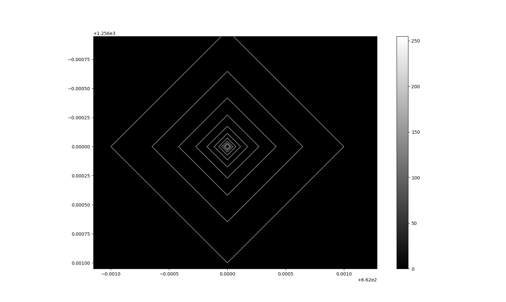

# Progress

Progress 5/28/19
* Wanted to find continuum fit for each order.
* Thought I could do it by thresholding the image and using an OpenCV function to find contours.
* Turns out this is a bad approach.
* However, what it DOES do, is find singular bright spots in the image, which could be useful for cosmic ray detection. I am posting an image here: 

* Zooming into a particular dot gives us this. I do not know what this is or why it happens. This can be looked into later, since the contour method is not priority at the moment.

Progress 5/29/19
* Measured flux vs. y pixel at a particular x = 1000 pixels.
Obtained this plot: 

* The next step was to detect the order boundaries so that I could pick the midpoint to use as one of the points for the continuum fit.
* Tried shifting entire plot down by 10 - 20 pixels. Tried to use intersection points with 0 as the boundary locations, but that was unsuccessful
because it was too noisy.
* This would result in too many or too few boundary points.

* The next attempt was to reduce the noise by creating bins that contain the average value of all the pixels in that bin. The bins that contain big jumps between each
other is where the boundary would be.

# Miscellaneous Observations
5/30/19
* Tried irfft the intensity, plotted logarithmically, and this is what resulted. There is a perfect left right symmetry...not sure what that means.

